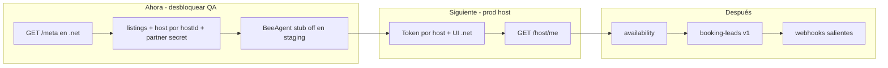

# Opinión — documentos BeeAgent Codex vs urbnbee.net (repo actual)

**Autor:** revisión cruzada desde el repo `Urbnbee-Rentals` (`web/`)  
**Fuentes leídas:**
- `c:\Master URBNBEE Codex\docs\HANDOFF_URBNBEE_NET_PARA_EQUIPO_NET.md`
- `c:\Master URBNBEE Codex\docs\INTEGRATION_URBNBEE_NET_FROM_BEEAGENT.md`
- `c:\Master URBNBEE Codex\docs\SISTEMA_PAGOS_Y_TIENDA_URBNBEE.md`  
**Fecha:** 2026-05-28

---

## Resumen en una frase

Los tres documentos del Codex están **bien escritos y van en la dirección correcta**, pero mezclan dos productos distintos (BeeAgent SaaS vs marketplace .net) y el **contrato de integración I.0** no coincide con lo que **ya está implementado** en `urbnbee.net` — hace falta un **adaptador explícito** o actualizar el cliente BeeAgent, no asumir que .net ya tiene `/host/me` ni tokens por host.

---

## 1. `HANDOFF_URBNBEE_NET_PARA_EQUIPO_NET.md`

### Lo bueno

- Formato claro: qué hizo BeeAgent, qué pide a .net, flujo host, preguntas numeradas, cómo probar con stub.
- Las **17 preguntas** son las correctas para desbloquear I.0 (auth, IDs, paquetes, UI token, webhooks, fechas).
- Separar Messenger como contexto paralelo evita que el equipo .net piense que bloquea listings.

### Opinión

- **Úsalo como checklist de respuesta:** conviene que el equipo .net conteste el §4 pegando respuestas reales (este documento incluye borrador en §5).
- **No esperes que .net “ya tenga” I.0** solo porque exista carpeta `beeagent/v1` — ver §3 de este archivo.
- **Prioridad acordada:** I.0 read-only + UI token en .net es sensato; BeeAgent con stub hasta entonces también.

---

## 2. `INTEGRATION_URBNBEE_NET_FROM_BEEAGENT.md`

### Lo bueno

- Contrato REST detallado (shapes JSON, paginación, availability, booking-leads, booking-link, webhooks v2).
- Roadmap conjunto I.0–I.8 con responsables.
- Auth **por token de host** (hash en BD, mostrar una vez) es el diseño correcto para producción.
- Idempotency y rate limit en v2: bien pensado.

### Gap crítico: contrato vs código en `Urbnbee-Rentals` (mayo 2026)

| Contrato BeeAgent | Estado en `web/` hoy |
|-------------------|----------------------|
| `GET .../host/me` (token → host implícito) | **No existe.** Existe `GET .../v1/host/:hostId` con **secret global** |
| `GET .../host/listings` (sin `hostId` en query) | **Parcial:** `GET .../v1/listings?hostId=` + mismo secret global |
| `GET .../host/listings/:id` | **Parcial:** `GET .../v1/listings/:listingIdOrSlug` |
| `GET .../host/availability` | **No existe** |
| `POST .../host/booking-leads` (lead formal + URLs) | **Parcial:** `POST .../v1/booking-leads` → **inbox** (`appendMessage`), no `booking_leads` ni `pending_host` |
| `POST .../host/booking-link` | **No existe** |
| `verification.package` (`growth_booking`, etc.) | **No existe** en API host; membresía actual es **huésped** (`guest-verification.json`), no paquetes host |
| Webhooks .net → urbnbeeai.com | **Entrada** sí: `POST .../v1/webhooks/events` (BeeAgent → .net). **Salida** .net → BeeAgent: **no** |
| Auth: Bearer **token por host** | Auth: Bearer = **`URBNBEE_PARTNER_API_SECRET`** (una sola llave servidor-a-servidor) |

**Meta descubrible:** `GET /api/integrations/beeagent/v1/meta` documenta las rutas **reales** (hostId en path/query, partner secret). BeeAgent debería leer `meta` en staging antes de cablear `urbnbee-net-client` al contrato §3.

### Opinión técnica

1. **No reescribir todo el contrato de golpe.** Dos caminos válidos:
   - **A (rápido):** En BeeAgent, fase 0 usa secret global + `hostId` explícito (lo que .net ya tiene) + mapeo de campos `HostListingRecord` → shape del contrato.
   - **B (correcto prod):** En .net, añadir rutas alias `/host/me`, `/host/listings` que resuelvan token por host y deleguen al store actual; mantener rutas viejas por compatibilidad.

2. **`booking-leads`:** Hoy es “mensaje en bandeja del host”, no lead de reserva con fechas/guests/channel. Para I.5 del contrato hace falta **nueva entidad** (tabla o status en `bookings`) o ampliar POST actual sin romper inbox.

3. **Paquetes host (`starter_booking` / `growth_booking`):** Están en el brief de producto .net pero **no en código**. BeeAgent no debe exigir `package` en `403` hasta que .net los implemente, o devolver `package: null` y tratar “sin paquete” como permitido en beta.

4. **IDs:** En .net, `listing.id` es string interno (`lst_…` / uuid según store), `slug` para URL pública. El contrato puede usar `listing_id` = `id` y `public_url` con slug — documentar en respuesta al handoff §4.4.

5. **CORS:** BeeAgent llama **server-to-server**; CORS en .net es secundario. Lo importante es Bearer + (futuro) token por host.

---

## 3. `SISTEMA_PAGOS_Y_TIENDA_URBNBEE.md`

### Lo bueno

- Explica con claridad **dos mundos de pago** (SaaS tenant → URBNBEE vs cliente final → tenant).
- Stripe del **tenant** cifrado en `customers`, Checkout Session, transferencia con comprobante: modelo sólido para **restaurantes / citas** en BeeAgent.
- Apartado “URBNBEE no es banco”: útil para legal y para no mezclar responsabilidades.

### Advertencia importante (no confundir productos)

Este documento describe **`beeagent-ui`** (urbnbeeai.com): tienda `/s/{slug}`, citas `/cita/{slug}`, MySQL `customers`, `stores`, `store_orders`.

**No describe el marketplace `urbnbee.net` (`Urbnbee-Rentals`):**

| Tema | BeeAgent (doc pagos) | urbnbee.net (repo actual) |
|------|----------------------|---------------------------|
| “Tenant” | Workspace `customers` en MySQL | **Host** = usuario `role: host` en `marketplace-store.json` |
| Cobro al cliente del negocio | Stripe keys **del tenant** en `/payments` | Checkout reserva vía Stripe **plataforma** (parcial); simulación si no hay key |
| Suscripción plataforma | Plan SaaS BeeAgent | **Membresía huésped** (`STRIPE_PRICE_VERIFICATION_*`) + Identity |
| Tienda / menú | `stores`, `store_orders` | **Listings** + `bookings` + fotos en volumen |
| Mercado Pago | Planificado en BeeAgent | **No** en .net |

**Opinión:** compartir este MD con la IA de .net está bien **como referencia de filosofía de pagos** (quién es procesador, quién no), pero **no** como spec de implementación directa en urbnbee.net. Para .net, la fuente de verdad sigue siendo `URBNBEE_INFRASTRUCTURE_BRIEF.md`, `URBNBEE_AI_HANDOFF.md` y `web/.env.example` (Stripe membresía + booking).

Si en el futuro .net vende **paquetes host** (Starter/Growth/Scale) con Stripe, el patrón “dos mundos” del doc de pagos **sí** aplica: membresía host = Stripe plataforma; pago de estancia = Connect o keys host (roadmap).

---

## 4. Respuestas sugeridas al handoff (§4) — para pegar al equipo BeeAgent

### A. Estado actual en el repo .net

1. **Rutas bajo `/api/integrations/beeagent/v1/*`:** sí, implementadas: `meta`, `listings`, `listings/[id]`, `host/[hostId]`, `booking-leads`, `webhooks/events`; `health` fuera de v1. **No** implementadas: `host/me`, `host/listings` (estilo token), `host/availability`, `host/booking-link`.
2. **Auth hoy:** solo **`URBNBEE_PARTNER_API_SECRET`** global (Bearer). **No** hay token por host en BD aún.
3. **Prod:** `https://www.urbnbee.net`. Staging: no documentado en repo; usar preview Railway si existe.

### B. Modelo de datos

4. **`listing_id`:** usar `listing.id` interno; slug en URLs públicas (`/listings/[slug]`).
5. **Disponibilidad:** calendario host existe en UI; **no** expuesto en API BeeAgent aún.
6. **`booking_leads`:** hoy POST lead = mensaje en **inbox**; reservas formales en `bookings.json` con otro flujo. Tabla/estado `pending_host` = **por definir** (recomendado en I.5).

### C. Producto / permisos

7. **Paquetes host para BeeAgent:** **ninguno en código**; todos los hosts con partner secret podrían llamar API (MVP). Restricción por paquete = roadmap.
8. **Varios tokens por host:** contrato recomienda sí; **no implementado** (0 tokens hoy).
9. **Rate limits:** no implementados.

### D. UI en .net

10. **Integraciones → BeeAgent:** **no existe** pantalla; propuesta: `/host/settings/integrations` o pestaña en perfil host.
11. **Token una sola vez:** acordamos sí (patrón Stripe) cuando se implemente.

### E. Webhooks y seguridad

12. **Firma entrante BeeAgent → .net:** `X-Urbnbee-Signature: sha256=<hmac>` con `URBNBEE_PARTNER_WEBHOOK_SECRET` (o API secret si webhook secret vacío). Saliente .net → BeeAgent: **pendiente** (contrato §3.7).
13. **CORS:** allowlist `URBNBEE_PARTNER_ORIGINS`; llamadas server-to-server no dependen de CORS.

### F. Timeline (estimación honesta desde repo actual)

14. **I.0 staging:** 1–2 semanas si se elige camino **A** (adaptar cliente BeeAgent a API actual) + documentar shapes; 3–4 semanas si camino **B** (token por host + `/host/me` + shapes contrato).
15. **UI token:** +1 semana después de diseño de tabla/hash.
16. **QA:** hace falta host de prueba en prod/staging con `URBNBEE_PARTNER_API_SECRET` en Railway y 1–2 listings publicados; BeeAgent puede usar `GET .../meta` y `listings?hostId=` sin esperar I.1.

### G. Desacuerdos / diff al contrato

17. **Diff mínimo recomendado para I.0:**
   - Aceptar temporalmente `GET /v1/host/:hostId` + `?hostId=` en listings con **partner secret**, **o**
   - Añadir en .net `GET /v1/host/me` que valide token por host y devuelva el JSON del contrato.
   - `verification.package`: permitir `null` hasta paquetes host.
   - `booking-leads`: documentar que v0 = inbox; v1 = lead con fechas (contrato §3.5).

---

## 5. Recomendación de coordinación (prioridades)

1. **Esta semana:** BeeAgent prueba contra `meta` + `listings?hostId=` + secret en Railway; .net confirma `URBNBEE_PARTNER_API_SECRET` y un `hostId` de prueba.
2. **Paralelo:** .net implementa `GET /host/me` + tokens (I.1) sin borrar rutas actuales.
3. **No priorizar** replicar tienda `/s/` ni Stripe-per-tenant del doc de pagos en .net hasta tener paquetes host y Connect claros.
4. **Membresía huésped** (Stripe live/test mismatch que viste en prod) es **independiente** de esta integración; arreglar prices `sk_live_` vs `price_` test antes de demos con huéspedes reales.

---

## 6. Veredicto

| Documento | ¿Aprobar dirección? | ¿Usar como spec directa en .net? |
|-----------|---------------------|----------------------------------|
| Handoff | Sí | Sí (como lista de preguntas/respuestas) |
| Integración | Sí, con diff §4G | Parcial hasta implementar token/host/me |
| Pagos y tienda | Sí (BeeAgent) | **No** como spec de .net; solo filosofía |

La otra IA del Codex va **adelantada en producto y contrato**; el repo .net va **adelantado en rutas partner globales e inbox**, pero **atrás en token por host y shapes del contrato**. El trabajo no es “empezar de cero”, es **alinear nombres y auth** y luego cerrar availability/leads.

---

## 7. Archivos útiles en disco (equipo .net)

| Qué | Ruta |
|-----|------|
| API partner | `c:\Users\edgar\SynologyDrive\E\Urbnbee Airbnbe\web\app\api\integrations\beeagent\` |
| Auth/CORS partner | `c:\Users\edgar\SynologyDrive\E\Urbnbee Airbnbe\web\lib\beeagent-partner.ts` |
| Handoff interno | `c:\Users\edgar\SynologyDrive\E\Urbnbee Airbnbe\URBNBEE_AI_HANDOFF.md` |
| Brief con índice docs | `c:\Users\edgar\SynologyDrive\E\Urbnbee Airbnbe\URBNBEE_TRUST_MARKETPLACE_BRIEF.md` (§ Documentación técnica) |

*Fin del documento — actualizar cuando .net implemente I.0/I.1 o BeeAgent confirme cliente contra `meta`.*
